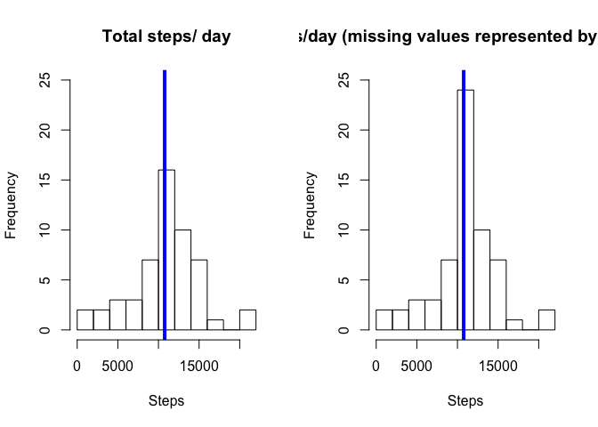
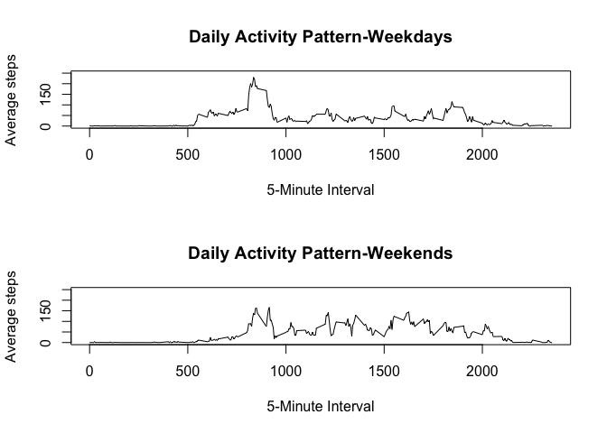

Reading and processing data
===========================

    activity <- read.csv("activity.csv", stringsAsFactors = FALSE)

str(activity) \`\`\`

    activity$date <- as.Date(activity$date)
    str(activity)

    ## 'data.frame':    17568 obs. of  3 variables:
    ##  $ steps   : int  NA NA NA NA NA NA NA NA NA NA ...
    ##  $ date    : Date, format: "2012-10-01" "2012-10-01" ...
    ##  $ interval: int  0 5 10 15 20 25 30 35 40 45 ...

    sum(is.na(activity$steps))

    ## [1] 2304

Mean total number of steps/day and histogram
--------------------------------------------

    activityrm<-activity[which(!is.na(activity$steps)),]
    perday<-tapply(activityrm$steps, activityrm$date, sum)
    hist(perday,10, main = "Total steps/day", xlab = "")

\#\#Average daily activity pattern

    dailyact<-tapply(activityrm$steps, activityrm$interval, mean)
    plot(y = dailyact, x = names(dailyact), type = "l", xlab = "5-Minute-Interval", 
        main = "Daily Activity Pattern", ylab = "Average steps")

    dailyact[dailyact==max(dailyact)]

    ##      835 
    ## 206.1698

Imputing missing values
-----------------------

    sum(is.na(activity$steps))

    ## [1] 2304

    sum(is.na(activity))

    ## [1] 2304

    actnew <- activity
    actnew[which(is.na(actnew$steps)),1]<-
    dailyact[as.character(actnew[which(is.na(actnew$steps)),3])]
    sum(is.na(actnew))

    ## [1] 0

    perday_new<-tapply(actnew$steps, actnew$date, sum)
    par(mfrow=c(1,2))
    hist(perday,10, main = "Total steps/ day", xlab = "Steps", ylim =c(0, 25))
    abline(v = median(perday), col = 4, lwd = 4)
    hist(perday_new,10, main = "Total steps/day (missing values represented by interval mean)", xlab = "Steps", ylim =c(0, 25))
    abline(v = median(perday_new), col = 4, lwd = 4)

    mean(perday_new)

    ## [1] 10766.19

    median(perday_new)

    ## [1] 10766.19

    mean(perday_new)-mean(perday)

    ## [1] 0

    median(perday_new)-median(perday)

    ## [1] 1.188679

Differences in activity patterns between weekdays and weekends
--------------------------------------------------------------

    actnew$wd<-weekdays(actnew$date)
    actnew$fwd<- as.factor(c("weekend", "weekday"))
    actnew[actnew$wd == "Sunday" | actnew$wd == "Saturday" ,5]<- factor("weekend")
    actnew[!(actnew$wd == "Sunday" | actnew$wd == "Saturday"),5 ]<- factor("weekday")

    actnew_we <- subset(actnew, fwd == "weekend")
    actnew_wd <- subset(actnew, fwd == "weekday") 
    dailyact_we<-tapply(actnew_we$steps, actnew_we$interval, mean)
    dailyact_wd<-tapply(actnew_wd$steps, actnew_wd$interval, mean)
    par(mfrow=c(2,1))
    plot(y = dailyact_wd, x = names(dailyact_wd), type = "l", xlab = "5-Minute Interval", 
         main = "Daily Activity Pattern-Weekdays", ylab = "Average steps", 
         ylim =c(0, 250))
    plot(y = dailyact_we, x = names(dailyact_we), type = "l", xlab = "5-Minute Interval", 
         main = "Daily Activity Pattern-Weekends", ylab = "Average steps", 
         ylim =c(0, 250))

